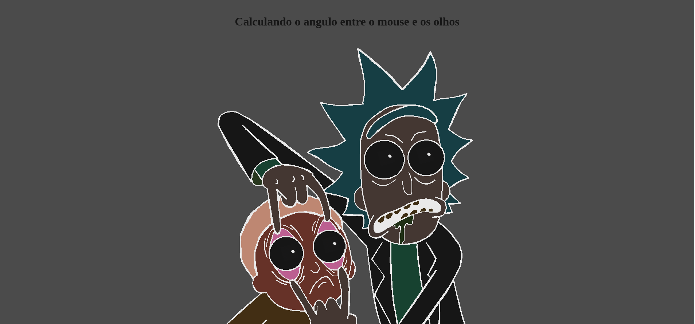

# Seja bem vindo a um dos meus #JokeCodes
Nesse código, eu uso matemática para calcular o angulo entre o mouse e um ponto X na tela, nesse caso o ponto X é o meio da imagem do Rick and Morty.



## Como usar esse repositório?
Para usar, basta baixar e/ou clonar o repositório e ter instalado o Live Server no seu VSCode para rodar o código html!

## Como isso foi feito?

### HTML
Primeiro, criei um elemento main, dentro dele coloco uma imagem que será nossa referencia, nesse caso a imagem do Rick and Morty, abaixo dela você deve criar **uma div com quatro olhos dentro, e posicionar manualmente esses olhos via `inline css`**

```html
    <main>
	    
	    <div  id="eyes">
	    
	    
	    
	    
	    </div>
    </main>
```

### CSS
Primeiramente eu defino uma cor para o fundo, que no caso será o próprio body, depois, defino o display do container `main` que usei acima para grid, mas poderia ser um **flexbox**, centralizo tudo e pronto.
Depois, trabalho com os olhos, defino eles para um tamanho menor, coloco eles em `position: absolute;` e finalmente adiciono alguns estilos para o texto do H1.

```html
    <style>
    	body {
    	background-color: rgb(75, 75, 75);
    	color: #fff;
    	padding: 0;
    	margin: 0;
    	}
    
    	main {
    	display: grid;
    	place-items: center;
    	min-height: 100vh;
    	position: relative;
    	}
    
    	.eye {
    	width: 40px;
    	}
    
    	#eyes,  #eyes  img {
    	position: absolute;
    	}
    
    	h1 {
    	font-size: 2rem;
    	font-weight: 600;
    	text-align: center;
    	padding: 20px  10px  5px  10px;
    	}
    </style>
```

### Finalmente! O JAVASCRIPT!
Para fazer isso a primeira coisa é pegar os elementos que vamos usar, no caso, a imagem do Rick and Morty, o proprio Body e uma coisa chamada Rect (O método `Element.getBoundingClientRect() retorna o tamanho de um elemento e sua posição relativa ao viewport.`)

```javascript
    const  morty  =  document.getElementById('morty');
    const  body  =  document.querySelector('body');
    const  rekt  =  morty.getBoundingClientRect();
```

Agora, vou calcular o centro desse "retangulo imaginário" que chamamos de **Rect**.

```javascript
    const  mortyX  =  rekt.left  + (rekt.width  /  2);
    const  mortyY  =  rekt.top  + (rekt.height  /  2);
```

#### Finalmente, adicionaremos o event listener!
O event listener aqui será o `mousemove`, o que vamos fazer é pegar a posição X e Y do mouse.

```javascript
    document.addEventListener('mousemove', (e) => {
    	const  mouseX  =  e.clientX;
    	const  mouseY  =  e.clientY;
    	// ...
    })
```
    
Agora, vamos usar matemática para criar uma função que vai pegar os pontos X e Y do Mouse e os pontos X e Y do centro do nosso **Rect**, normalizar esses pontos subtraindo um do outro `dy = y2 - y1` e `dx = x2 - x1` e usando a função `Math.atan2(dy, dx)` vamos calcular o angulo entre esses dois pontos, o retorno dessa função está em **radianos**, então, vamos converter em **graus** e retornar.

```javascript
	const  calculateAngle  = (x1, y1, x2, y2) => {
	const  dy  =  y2  -  y1;
	const  dx  =  x2  -  x1;
	const  rad  =  Math.atan2(dy, dx); // Calcula em radianos [-PI, PI]
	const  deg  =  rad  *  180  /  Math.PI; // Transforma em graus [-180, 180]
	return  deg;
}
```

#### Finalmente, nosso event listener está pronto!
Por fim, vamos juntar tudo que fizemos no event listener, agora nós temos que usando a propriedade `transform` girar o nosso **eye** com base no retorno da função que criamos acima, com uma pequena correção, devemos adicionar `90` graus ao nosso rotate!

```javascript
document.addEventListener('mousemove', (e) => {
	const  mouseX  =  e.clientX;
	const  mouseY  =  e.clientY;

	const  angulo  =  calculateAngle(mouseX, mouseY, mortyX, mortyY);

	// Agora vamos girar os olhos
	const  eyes  =  document.querySelectorAll('.eye');
	eyes.forEach((eye) => {
	eye.style.transform  =  `rotate(${90  +  angulo}deg)`;
	morty.style.filter  =  `hue-rotate(${angulo}deg)`;
	body.style.filter  =  `invert(${Math.abs(angulo) /  180})`;
	});
})
```

# E é assim que se faz!